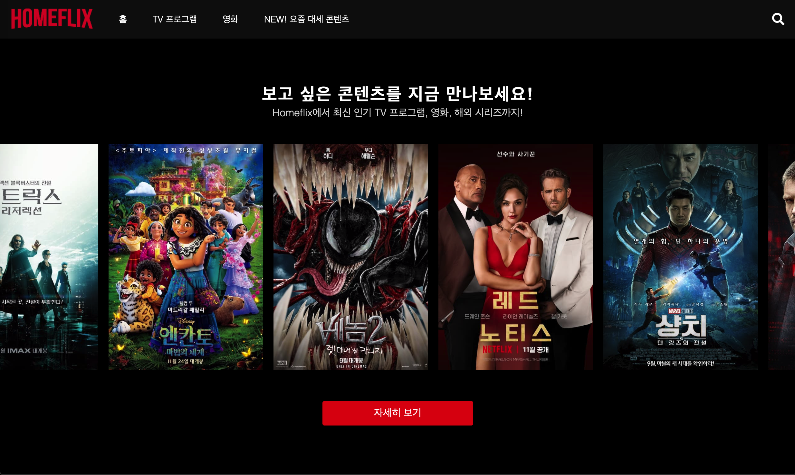
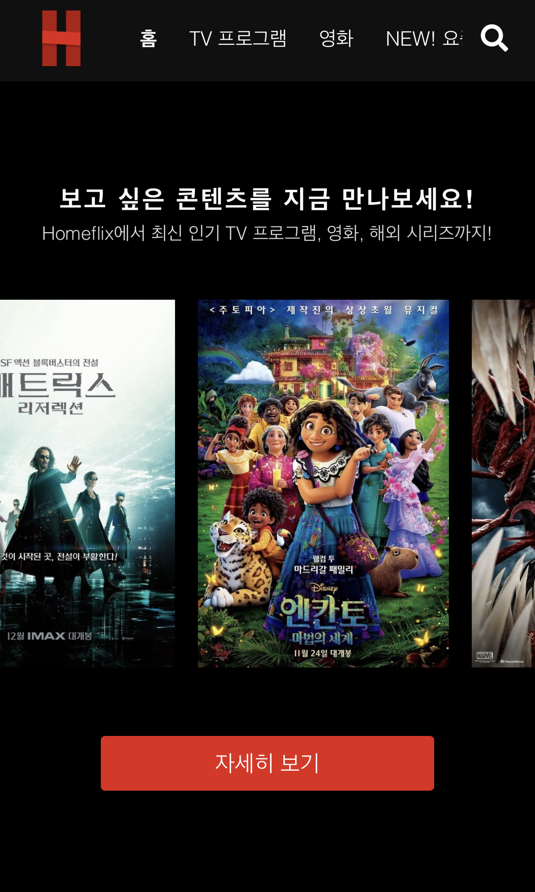
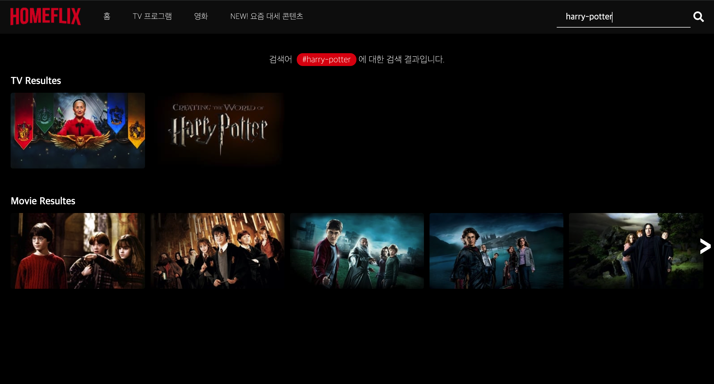

# 🎥 **homeflix**

## 1. 프로젝트 소개

TMBD API를 사용해 최신 TV 프로그램과 상영작 정보를 알려주는 웹 서비스로, netflix-clone 프로젝트입니다. 기존에 **클래스**로 구현했던 프로젝트를 **함수형**으로 변경하여 재구현했습니다. [> homeflix 프로젝트 바로가기!](https://je0489.github.io/homeflix/)

## 2. 기술 스택

  

## 3. 화면 별 설명

### 3-1. 홈

- laptop/mobile 화면

    
    

① 최신 인기 상영작 TOP 10 목록을 애니메이션을 적용하여 구현  
② useRef를 사용하여 어떤 크기의 기기를 사용해도 top 10 목록의 시작과 끝에 애니메이션이 정상적으로 동작하도록 구현

### 3-2. TV 프로그램

- laptop 화면

① mount 시, random 함수를 통해 인기 TV 프로그램 TOP 5의 일부 정보(포스터, 로고, 프로그램 설명)를 화면에 표시  
② 프로그램 설명 길이가 100자 이상인 경우, 문장이 끝나는 데까지 표시되도록 구현  
③ 좌측(<), 우측(>) 버튼 클릭 시 스크롤 이동  
④ 카드 마우스 오버 시, 선택한 카드의 상세 정보(제목, 장르)가 애니메이션과 함께 표시되도록 구현

> 메뉴 "영화"와 "NEW 요즘 대세 콘텐츠"도 동일하게 동작

### 3-3. 비디오 정보 디테일

- laptop 화면

① 클릭한 비디오에 대한 일부 정보(포스터, 로고, 방영일자, 설명, 예고편, 관련 영상) 표시  
② 예고편의 유투브 썸네일을 가져와 crop 작업  
③ 관련 영상(More Like This) 영역 클릭 시 재로딩 후 클릭한 비디오의 정보가 표시되도록 구현  
④ 닫기 버튼 또는 해당 페이지 외 다른 부분 클릭 시 페이지 닫기

### 3-4. 검색

- laptop 화면

① 입력한 검색어에 대한 결과과 표시되도록 구현  
② 검색 결과가 5개 이하인 경우 좌측(<), 우측(>) 버튼이 표시되지 않도록 구현

4.  추후 구현 예정

- [x] 홈을 제외한 메뉴 클릭 시 대표 포스터 및 로고 표시
- [ ] 반응형 디자인 적용
- [ ] dark/light mode 적용
- [ ] language 설정 기능 추가
